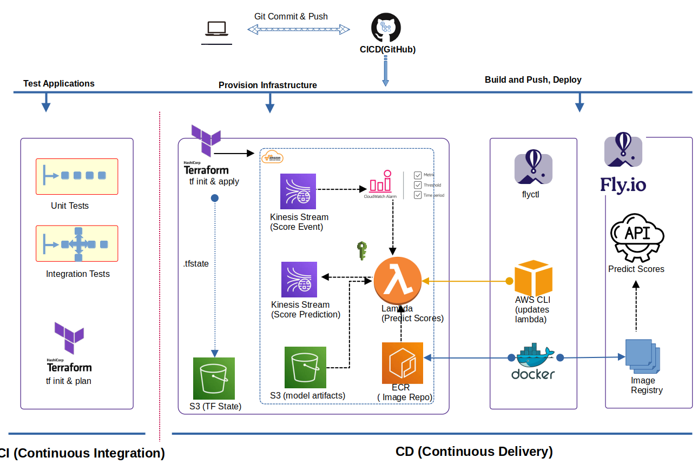

# Credit Scoring System

This project build a credit scoring system that can be used to score customers.

## Introduction to credict scoring

Credit scoring systems comprises of data pipeline, models, monitoring and strategies mostly represented as statistical tools used by lenders and financial institutions to assess the creditworthiness of individuals or businesses applying for credit, such as loans, credit cards, or mortgages. The primary purpose of credit scoring is to evaluate the risk associated with extending credit to a borrower and to predict the likelihood of that borrower defaulting on their financial obligations.

Relevance of Credit Scoring Systems:

1. Risk Assessment: Credit scores help lenders evaluate the level of risk associated with lending money to a particular individual or business. A higher credit score indicates a lower perceived risk, making it more likely for the borrower to obtain credit at favorable terms, such as lower interest rates.

2. Objective and Consistent Evaluation: Credit scoring systems use objective criteria and mathematical algorithms to calculate credit scores. This removes subjective biases and ensures a standardized evaluation process for all applicants, regardless of the lender's personal opinions. Every decision should be explained in simple terms.

3. Efficient Decision-Making: Credit scoring enables quick and efficient decision-making for lenders. Instead of manually reviewing each applicant's credit history, lenders can rely on credit scores to assess creditworthiness rapidly, streamlining the lending process. Automated scoring added with strategies can lead to auto approvals.

4. Widely Used Industry Tool: Credit scoring models are widely used in the financial industry and are accepted as a standard method for evaluating credit risk. This widespread acceptance allows for easier comparisons between different borrowers and institutions.

5. Accessibility of Credit: Credit scoring systems have made credit more accessible to a broader range of individuals, including those with limited credit histories. By considering various factors beyond just credit history, such as payment behavior and income, these models help in evaluating the creditworthiness of individuals with thin credit files.

6. Predictive Power: Credit scoring models have been refined and improved over time, making them highly predictive of a borrower's credit behavior. This predictive power assists lenders in making well-informed decisions and reducing the likelihood of defaults.

Given how crucial credit scoring systems can facilitate responsible lending, improve access to credit, and help maintain stability in the financial system by managing credit risk effectively. They benefit both lenders and borrowers by enabling fair and efficient credit evaluations. Given the potentials to improve the living conditions of underserved and underrepresented populations, we embark on a project to design a credit scoring system. Our system will produce scores ranging from about 350  to 950. With higher scores signifying good credit worthiness and lower scores those that needs improvement.

## Project Structure

The project is devided into 5 major sections which includes

- data preparation
- model development
- model validation
- infrastructure
- deployment
- monitoring

Implementation of and end to end credit system scoring system. This starts from data ingestion to a deployment and monitoring with a full CICD with best practices of MLOPS. 

The detail instructions for working with each of the sections is provided in readme files present in each of the directories.

## The Data

The data is the anonymized dataset of Home Equity Line of Credit (HELOC) applications made by real homeowners. As explained by [FICO](https://community.fico.com/s/explainable-machine-learning-challenge?tabset-158d9=3), a HELOC is a line of credit typically offered by a bank as a percentage of home equity (the difference between the current market value of a home and its purchase price). The customers in this dataset have requested a credit line in the range of $5,000 - $150,000. The fundamental task is to use the information about the applicant in their credit report to predict whether they will repay their HELOC account within 2 years. This prediction is then used to decide whether the homeowner qualifies for a line of credit and, if so, how much credit should be extended.

The data contain 23 predictor variables, which are quantitative or categorical, and come from anonymized credit bureau data. The target variable to predict is a binary variable called _RiskPerformance_. The value _Bad_ or _1_  indicates that a consumer was 90 days past due or worse at least once over a period of 24 months from when the credit account was opened. The value _Good_ or _0_ indicates that they have made their payments without ever being more than 90 days overdue.

## Reproducibility

To reproduce the model, we are going to go through a section at a time. Follow the hyperlink to the respective section. The reason for this organization is that it makes it easy for anyone to reused the sections as they are almost standalone. Another reason is that we don't want to read me to be several pages. So we release only what is needed at a time.

## [Model Development](credit-risk-model)

This is a stage in which the model is developed. The project here is building a risk scoring system where every customer is assigned a score that will range from 350 to 950. Details of the model are found in the [credit risk model directory](credit-risk-model).

## [Deployment](deployment)

This is a stage in which the model is deployed in the following deployment

- batch
- webservice
- streaming

## [Monitoring](monitoring)

Models depreciate, data changes, many things can go wrong! Monitoring provide us the ability to understand the behaviour of our system as changes occur. It provide us the ability to possibily metigate down town before they occur. Our system uses [Evidently to monitor](monitoring) the services and display metrics via Gafana.

## [Code Quality](automation/integration-test)

Quality and standards helps us metigate drift in out code. It also help us to identify non conforming code as well as vulnerabilities. Standards are maintained via continous testing of out code. This is achieved via [unit test](automation/tests/), [integration test](automation/integration-test). We also use SonarQube to monitor the quality and display it beautifully in a dasboard.

## [Continuous Integration](.github/actions/ci-test.yaml)

To ensure that our development is smooth and free from manual errors, we implented continuous integration to ensure that our components integrates properly. We leverage the power of GitHub Actions to ensure that our system stays intact as we develop new features.

## [Continuous Delivery](.github/actions/cd-deploy.yaml)

To ensure that our model and artifacts are delivered in a timely and consisten fashion, we implented continuous delivery to ensure that our model is continually deployed when ever a feature is added that makes the final cut.

## Contact

Best way to reachout is to post on the issues and we discuss there so that others can benefit.
