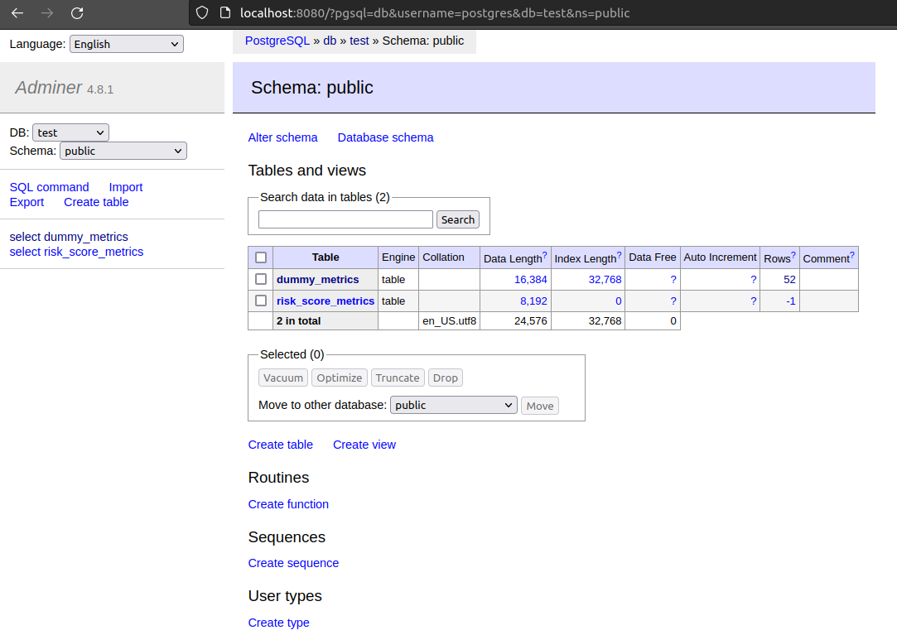

# [Week 5: Monitoring](https://github.com/DataTalksClub/mlops-zoomcamp)

## Introduction

Monitoring is the ability to keep a close look on the models we deploy, the data that the model is running on as well as the infrastructure that suppors it.
With monitoring, we can be proactive and anticipate problems before they occur. Also, when the system is not working we can tell what set of possibilities that can be and some how fix the problem.

Monitoring ML models is mostly around monitoring four sectors:

1. Service Health: General Software health check
2. Model Performance: Depending on metrics for the problem
3. Data Quality and integrity
4. Data Drift & Concept Drift

Over time, machine learning (ML) models can experience degradation, which can be attributed to two main effects:

Data Drift: This occurs when new input data deviates from the distribution of the model's training dataset. For example, if three popular venues have opened in the last month, but the training dataset used for a Taxi duration model does not include samples from this new data, the model may struggle to accurately predict trip durations for these new scenarios.

Concept Drift: Unlike data drift, concept drift refers to a change in the underlying relationship between inputs and outputs, rather than a change in the data itself. This drift is typically caused by changes in the "concepts" or underlying factors that influence the target variable. For instance, if taxi cars have been replaced by newer, faster, and more agile vehicles, the previously trained model may no longer provide accurate predictions for trip durations.

In a comprehensive monitoring setting, it is advisable to monitor the following criteria:

- Performance by Segment: Assessing the model's performance across different segments of the input distribution.
- vModel Bias/Fairness: Evaluating the presence of bias or unfairness in the model's predictions.
- Outliers: Identifying and handling outliers, which may impact model performance.
- Explainability: Ensuring the model's decisions can be explained and understood.

Monitoring strategies can differ based on the ML model's paradigm:

### Batch Models

For batch models, monitoring involves incorporating calculation blocks in the pipeline to perform checks and assess whether the model is behaving as expected. Performance and health metrics are calculated, logged in a SQL or NoSQL database, and used to generate reports.

### Online Models

 Real-time served models require closer monitoring in real-time. A monitoring service continuously pulls metrics from the model and updates visuals or dashboards in real-time to provide a live view of the model's performance.

Sometimes, even for online models, it may be necessary to periodically monitor the model in batch mode. Certain issues, such as data drift and concept drift, may only become evident over a longer timespan or when considering larger datasets.

## Monitoring our service

We have a service deployed. The service in this case is a scorecard model. We will deploy two types of monitorin: Online monitoring via Prometheus and Grafana, and Offline monitoring via EvidentlyAI. Our implementation will follow something like this image 

### Evidently

With Evidently, we can calculate various metrics. We can visualized them in Evidently UI, however, we will canculate the metrics and store in a databse. Grafana can then be used to visualize the metrics.
We start by testing how to create metrics. in the script below

```py
import datetime
import time
import random
import logging 
import uuid
import pytz
import pandas as pd
import io
import psycopg

# We always want to log data. We can specify how we want to log it.
logging.basicConfig(level=logging.INFO, format="%(asctime)s [%(levelname)s]: %(message)s")

SEND_TIMEOUT = 10
rand = random.Random()

# Create a datbe called dummy_metrics. It is exist, drop it first before creating.
create_table_statement = """
drop table if exists dummy_metrics;
create table dummy_metrics(
 timestamp timestamp,
 value1 integer,
 value2 varchar,
 value3 float
)
"""
# Prepare database.
# Fuction to check if database 'test' exist connect to it
# If not exist (via size), create a databse called 'test'
def prep_db():
 with psycopg.connect("host=localhost port=5432 user=postgres password=password", autocommit=True) as conn:
  res = conn.execute("SELECT 1 FROM pg_database WHERE datname='test'")
  if len(res.fetchall()) == 0:
   conn.execute("create database test;")
  with psycopg.connect("host=localhost port=5432 dbname=test user=postgres password=password") as conn:
   conn.execute(create_table_statement)

# Calculate metrics and insert them to table
def calculate_dummy_metrics_postgresql(curr):
 value1 = rand.randint(0, 1000)
 value2 = str(uuid.uuid4())
 value3 = rand.random()

 curr.execute(
  "insert into dummy_metrics(timestamp, value1, value2, value3) values (%s, %s, %s, %s)",
  (datetime.datetime.now(pytz.timezone('Europe/London')), value1, value2, value3)
 )

# Bring everything together.
# First we prepare database
# Connedt to the database 
# For 100 times, we send the results to our table. Simulating a streaming event.
def main():
 prep_db()
 last_send = datetime.datetime.now() - datetime.timedelta(seconds=10)
 with psycopg.connect("host=localhost port=5432 dbname=test user=postgres password=password", autocommit=True) as conn:
  for i in range(0, 100):
   with conn.cursor() as curr:
    calculate_dummy_metrics_postgresql(curr)

   new_send = datetime.datetime.now()
   seconds_elapsed = (new_send - last_send).total_seconds()
   if seconds_elapsed < SEND_TIMEOUT:
    time.sleep(SEND_TIMEOUT - seconds_elapsed)
   while last_send < new_send:
    last_send = last_send + datetime.timedelta(seconds=10)
   logging.info("data sent")

if __name__ == '__main__':
 main()
```

We prepare database, connect to database, interate and insert events in a batch values simulated by 10 seconds.

In the terminal, run

```sh
docker compose up
```

and activate the environment and run the dummy metrics generation via

```sh
pipenv shell
python dummy_metrics_calculation_risk
```

Open local host at port 5342, postgres and login using the passwords in the code. In this case, username=postgres and password=password and table=test. Select data to see all the data generated.


Open local host post 3000 and login to graphana with username=admin and password=admin. Select new visualization and add dashboard. Select source as postgreSQl and select the table dummy_test. In the columnns select _value1_ and _timestamp_ and click __Run qunery__. Zoom the graph to see the data that is coming in. Here is what I see for the graph. 

## Evidently metrics

We can run the script _evidently_metrics_calculations_risk.py_ to generate real metrics. We simulated data coming in for February 2023, on a daily basis. To run the script, ensure the docker compose servises mentioned above are running. This script uses prefect for orchestration so be sure to start the prefect server locally or used the cloud. A local server can be run at

```sh
prefect server start
```

Run the final script

```sh
evidently_metrics_calculations_risk.py
```

Refresh the postgres and go to db test. You can see the _risk_score_metrics_ metrics table  and when you click on it and go to the data you get . Go to grafana and select save, then add visualization. Select the table _risk_score_metrics_ and add _predicted_drift_ and _timestamp_ columns and run the query and finally apply. By doing the same for the other columns, her is what I get. . Save it and give it a name. 


We can save this dashboard DOM by going to the settings, see figure. Select JSON Model of the settings and copy the json file to [dashboards/data_drift.json](dashboards/data_drift.json) file. That way when the servise re-start, the dasboard will continue to add data. The parts of the docker-compose file are the volumes that are mounted to the grafana service. When I start here is what I see after some time is shown on the left. When much time has elapsed, I see the figure on the right.


 So basically, the grafana dashboards basically stores the object model.

